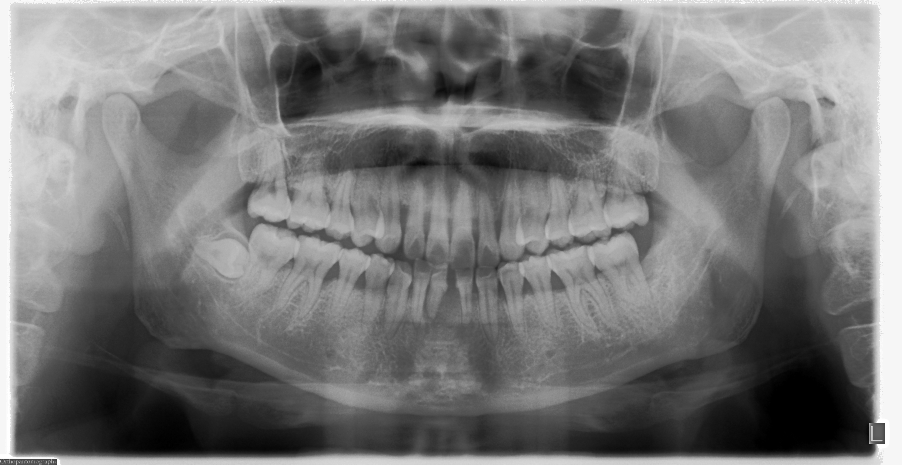
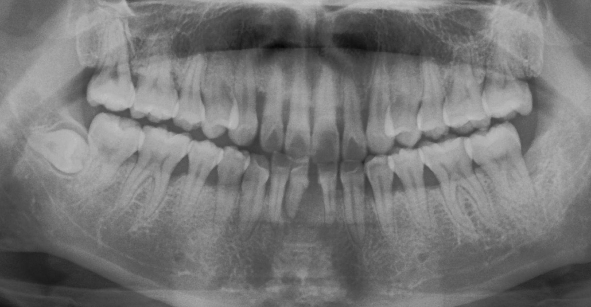
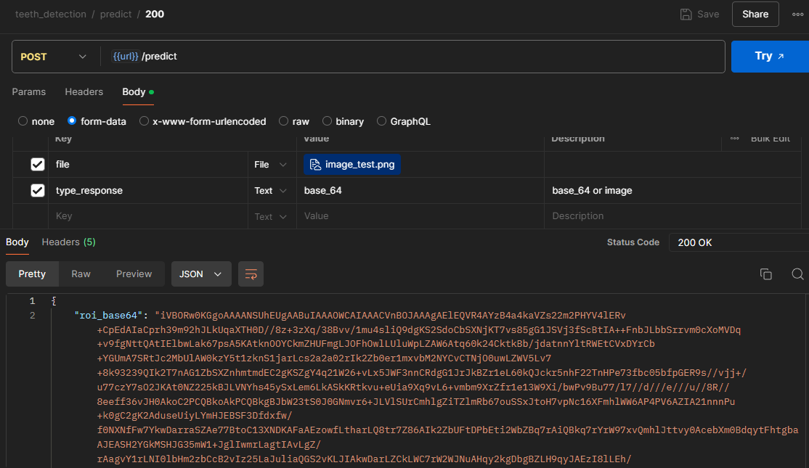
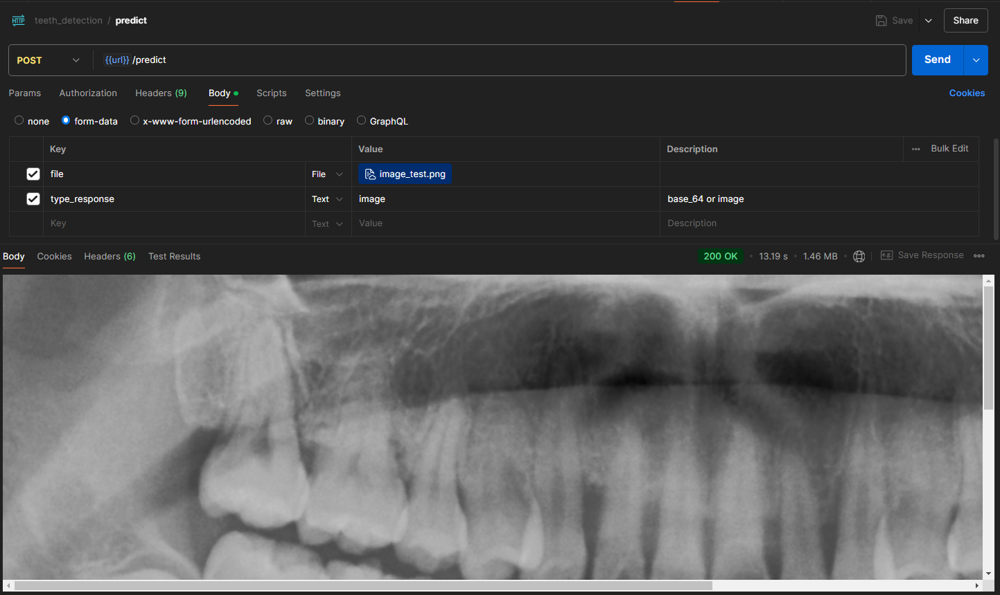

# Quickstart
This program will perform image cutting from panoramic dental scans using X-rays that take the entire image such as the neck bone, nose and others. This causes a lot of noise or pixels that are not needed if CNN is to be done. Therefore, with this program will detect only the tooth part, cut it and return it in the form of a base64 response or image.

## How to clone
```
git clone https://github.com/widiarrohman1234/Teeth-Detection.git
```

## How to create venv
```
python -m venv .venv
```

## How to enable .venv
- using linux
```
. .venv/bin/activate
```
- using windows
```
source .venv/Scripts/activate
```

## How to run app
```
flask --app main.py --debug run
```

# Detail Application
- input image

- output image


# Example Postman Image
- response base64

- response image


## Contact Me
- email: widiarrohman1234@gmail.com
